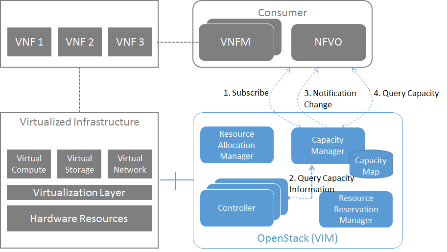
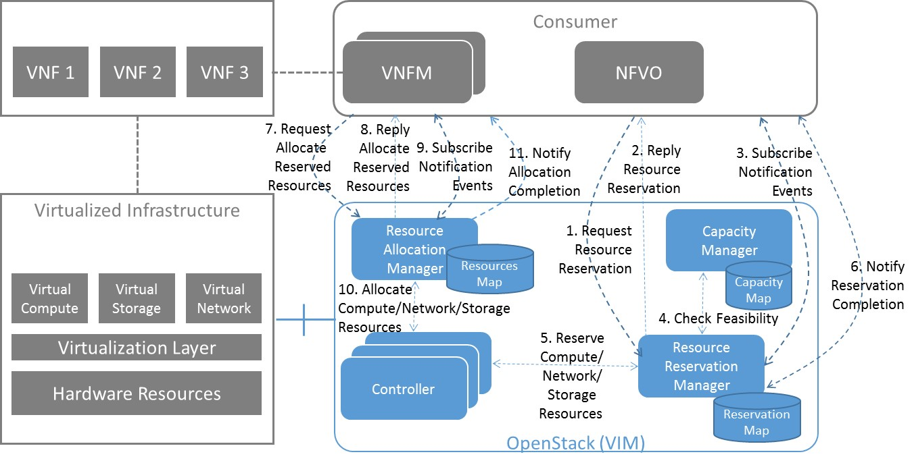

Shim-layer architecture
^^^^^^^^^^^^^^^^^^^^^^^

The *shim-layer architecture* is using a layer on top of OpenStack to provide
the capacity management and resource reservation features.

Detailed Message Flows
""""""""""""""""""""""

.. note:: **Editor's Note:** This section has to be updated.

Resource Capacity Management
''''''''''''''''''''''''''''

   Capacity Management Scenario

:numref:`figure5` shows a detailed message flow between the consumers and the
functional blocks inside the VIM and has the following steps:

Step 1: The consumer subscribes to capacity change notifications

Step 2: The Capacity Manager monitors the capacity information for the various
types of resources by querying the various Controllers (e.g. Nova, Neutron,
Cinder), either periodically or on demand and updates capacity information in
the Capacity Map

Step 3: Capacity changes are notified to the consumer

Step 4: The consumer queries the Capacity Manager to retrieve capacity detailed
information

Resource Reservation
''''''''''''''''''''

   Resource Reservation for Future Use Scenario

:numref:`figure6` shows a detailed message flow between the consumers and the
functional blocks inside the VIM and has the following steps:

Step 1: The consumer creates a resource reservation request for future use by
setting a start and end time for the allocation

Step 2: The consumer gets an immediate reply with a reservation status message
"reservationStatus" and an identifier to be used with this reservation instance
"reservationID"

Step 3: The consumer subscribes to reservation notification events

Step 4: The Resource Reservation Manager checks the feasibility of the
reservation request by consulting the Capacity Manager

Step 5: The Resource Reservation Manager reserves the resources and stores the
list of reservations IDs generated by the Controllers (e.g. Nova, Neutron,
Cinder) in the Reservation Map

Step 6: Once the reservation process is completed, the VIM sends a notification
message to the consumer with information on the reserved resources

Step 7: When start time arrives, the consumer creates a resource allocation
request.

Step 8: The consumer gets an immediate reply with an allocation status message
"allocationStatus".

Step 9: The consumer subscribes to allocation notification events

Step 10: The Resource Allocation Manager allocates the reserved resources. If
not all reserved resources are allocated before expiry, the reserved resources
are released and a notification is sent to the consumer

Step 11: Once the allocation process is completed, the VIM sends a notification
message to the consumer with information on the allocated resources