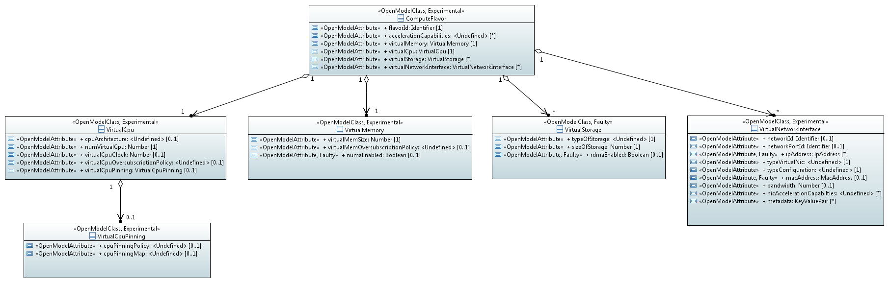

.. This work is licensed under a Creative Commons Attribution 4.0 International License.
.. http://creativecommons.org/licenses/by/4.0

.. _northbound_API:

Detailed northbound interface specification
===========================================

.. Note::
   This is Work in Progress.

ETSI NFV IFA Information Models
-------------------------------

Compute Flavor
^^^^^^^^^^^^^^

A compute flavor includes information about number of virtual CPUs, size of
virtual memory, size of virtual storage, and virtual network interfaces
[NFVIFA005]_.

Virtualised Compute Resources
-----------------------------

Compute Capacity Management
^^^^^^^^^^^^^^^^^^^^^^^^^^^

Subscribe Compute Capacity Change Event
"""""""""""""""""""""""""""""""""""""""

Subscription from Consumer to VIM to be notified about compute capacity changes

.. http:post:: /capacity/compute/subscribe
   :noindex:

   **Example request**:

   .. sourcecode:: http

       POST /capacity/compute/subscribe HTTP/1.1
       Accept: application/json

       {
          "zoneId": "12345",
          "computeResourceTypeId": "vcInstances",
          "threshold": {
             "thresholdType" : "absoluteValue",
             "threshold": {
                 "capacity_info": "available",
                 "condition": "lt",
                 "value": 5
             }
          }
       }

   **Example response**:

   .. sourcecode:: http

       HTTP/1.1 201 CREATED
       Content-Type: application/json

       {
          "created": "2015-09-21T00:00:00Z",
          "capacityChangeSubscriptionId": "abcdef-ghijkl-123456789"
       }

   :statuscode 400: computeResourceTypeId is missing

Query Compute Capacity for a defined resource type
""""""""""""""""""""""""""""""""""""""""""""""""""

Request to find out about available, reserved, total and allocated compute
capacity.

.. http:get:: /capacity/compute/query
   :noindex:

   **Example request**:

   .. sourcecode:: http

      GET /capacity/compute/query HTTP/1.1
      Accept: application/json

      {
        "zoneId": "12345",
        "computeResourceTypeId": "vcInstances",
        "timePeriod":  {
             "startTime": "2015-09-21T00:00:00Z",
             "stopTime": "2015-09-21T00:05:30Z"
        }
      }

   **Example response**:

   .. sourcecode:: http

       HTTP/1.1 200 OK
       Content-Type: application/json

       {
          "zoneId": "12345",
          "lastUpdate": "2015-09-21T00:03:20Z",
          "capacityInformation": {
             "available": 4,
             "reserved": 17,
             "total": 50,
             "allocated": 29
          }
       }

   :query limit: Default is 10.
   :statuscode 404: resource zone unknown

Query Compute Capacity with required attributes
"""""""""""""""""""""""""""""""""""""""""""""""
Request to find out available compute capacity with given characteristics

.. http:get:: /capacity/compute/query
   :noindex:

   **Example request**:

   .. sourcecode:: http

      GET /capacity/compute/query HTTP/1.1
      Accept: application/json

      {
        "zoneId": "12345",
        "resourceCriteria":  {
             "virtualCPU": {
                 "cpuArchitecture": "x86",
                 "numVirtualCpu": 8
             }
        },
        "attributeSelector":  "available",
        "timePeriod":  {
             "startTime": "2015-09-21T00:00:00Z",
             "stopTime": "2015-09-21T00:05:30Z"
        }
      }

   **Example response**:

   .. sourcecode:: http

       HTTP/1.1 200 OK
       Content-Type: application/json

       {
          "zoneId": "12345",
          "lastUpdate": "2015-09-21T00:03:20Z",
          "capacityInformation": {
             "available": 50
          }
       }

   :query limit: Default is 10.
   :statuscode 404: resource zone unknown

Notify Compute Capacity Change Event
""""""""""""""""""""""""""""""""""""

Notification about compute capacity changes

.. http:post:: /capacity/compute/notification
   :noindex:

   **Example notification**:

   .. sourcecode:: http

      Content-Type: application/json

      {
           "zoneId": "12345",
           "notificationId": "zyxwvu-tsrqpo-987654321",
           "capacityChangeTime": "2015-09-21T00:03:20Z",
           "resourceDescriptor": {
              "computeResourceTypeId": "vcInstances"
           },
           "capacityInformation": {
              "available": 4,
              "reserved": 17,
              "total": 50,
              "allocated": 29
           }
      }

Compute Resource Reservation
^^^^^^^^^^^^^^^^^^^^^^^^^^^^

Create Compute Resource Reservation
"""""""""""""""""""""""""""""""""""

Request the reservation of compute resource capacity

.. http:post:: /reservation/compute/create
   :noindex:

   **Example request**:

   .. sourcecode:: http

       POST /reservation/compute/create HTTP/1.1
       Accept: application/json

       {
           "startTime": "2015-09-21T01:00:00Z",
           "computePoolReservation": {
               "numCpuCores": 20,
               "numVcInstances": 5,
               "virtualMemSize": 10
           }
       }

   **Example response**:

   .. sourcecode:: http

       HTTP/1.1 201 CREATED
       Content-Type: application/json

       {
          "reservationData": {
             "startTime": "2015-09-21T01:00:00Z",
             "reservationStatus": "initialized",
             "reservationId": "xxxx-yyyy-zzzz",
             "computePoolReserved": {
                 "numCpuCores": 20,
                 "numVcInstances": 5,
                 "virtualMemSize": 10,
                 "zoneId": "23456"
             }
          }
       }

or virtualization containers

.. http:post:: reservation/compute/create
   :noindex:

   **Example request**:

   .. sourcecode:: http

       POST /reservation/compute/create HTTP/1.1
       Accept: application/json

       {
         "startTime": "2015-10-05T15:00:00Z",
         "virtualizationContainerReservation": [
           {
              "containerId": "myContainer",
              "containerFlavor": {
                 "flavorId": "myFlavor",
                 "virtualCpu": {
                    "numVirtualCpu": 2,
                    "cpuArchitecture": "x86"
                 },
                 "virtualMemory": {
                     "numaEnabled": "False",
                     "virtualMemSize": 16
                 },
                 "storageAttributes": {
                     "typeOfStorage": "volume",
                     "sizeOfStorage": 16
                 }
              }
           }
         ]
       }

   **Example response**:

   .. sourcecode:: http

       HTTP/1.1 201 CREATED
       Content-Type: application/json

       {
          "reservationData": {
             "startTime": "2015-10-05T15:00:00Z",
             "reservationId": "aaaa-bbbb-cccc",
             "reservationStatus": "initialized",
             "virtualizationContainerReserved": [
                 {
                    "containerId": "myContainer",
                    "flavorId": "myFlavor",
                    "virtualCpu": {
                        "numVirtualCpu": 2,
                        "cpuArchitecture": "x86"
                    },
                    "virtualMemory": {
                        "numaEnabled": "False",
                        "virtualMemSize": 16
                    },
                    "virtualDisks": {
                        "storageId": "myStorage",
                        "flavourId": "myStorageFlavour",
                        "typeOfStorage": "volume",
                        "sizeOfStorage": 16,
                        "operationalState": "enabled"
                    }
                 }
             ]
          }
       }

Query Compute Resource Reservation
""""""""""""""""""""""""""""""""""

Request to find out about reserved compute resources that the consumer has
access to.

.. http:get:: /reservation/compute/query
   :noindex:

   **Example request**:

   .. sourcecode:: http

      GET /reservation/compute/query HTTP/1.1
      Accept: application/json

      {
         "queryReservationFilter": [
             {
                 "reservationId": "xxxx-yyyy-zzzz"
             }
         ]

      }

   **Example response**:

   .. sourcecode:: http

       HTTP/1.1 200 OK
       Content-Type: application/json

       {
          "queryResult":
          {
             "startTime": "2015-09-21T01:00:00Z",
             "reservationStatus": "active",
             "reservationId": "xxxx-yyyy-zzzz",
             "computePoolReserved":
             {
                 "numCpuCores": 20,
                 "numVcInstances": 5,
                 "virtualMemSize": 10,
                 "zoneId": "23456"
             }
          }
       }

   :statuscode 404: reservation id unknown

Update Compute Resource Reservation
"""""""""""""""""""""""""""""""""""

Request to update compute resource reservation

.. http:post:: /reservation/compute/update
   :noindex:

   **Example request**:

   .. sourcecode:: http

       POST /reservation/compute/update HTTP/1.1
       Accept: application/json

       {
           "startTime": "2015-09-14T16:00:00Z",
           "reservationId": "xxxx-yyyy-zzzz"
       }

   **Example response**:

   .. sourcecode:: http

       HTTP/1.1 201 CREATED
       Content-Type: application/json

       {
         "reservationData": {
             "startTime": "2015-09-14TT16:00:00Z",
             "reservationStatus": "active",
             "reservationId": "xxxx-yyyy-zzzz",
             "computePoolReserved": {
                 "numCpuCores": 20,
                 "numVcInstances": 5,
                 "virtualMemSize": 10,
                 "zoneId": "23456"
             }
          }
       }

Terminate Compute Resource Reservation
""""""""""""""""""""""""""""""""""""""

Request to terminate a compute resource reservation

.. http:delete:: /reservation/compute/(reservation_id)
   :noindex:

   **Example response**:

   .. sourcecode:: http

       HTTP/1.1 200
       Content-Type: application/json

       {
          "reservationId": "xxxx-yyyy-zzzz",
       }

Subscribe Resource Reservation Change Event
"""""""""""""""""""""""""""""""""""""""""""

Subscription from Consumer to VIM to be notified about changes
related to a reservation or to the resources associated to it.

.. http:post:: /reservation/subscribe
   :noindex:

   **Example request**:

   .. sourcecode:: http

       POST /reservation/subscribe HTTP/1.1
       Accept: application/json

       {
          "inputFilter": [
              {
                 "reservationId": "xxxx-yyyy-zzzz",
              }
          ]
      }

   **Example response**:

   .. sourcecode:: http

       HTTP/1.1 201 CREATED
       Content-Type: application/json

       {
          "created": "2015-09-21T00:00:00Z",
          "reservationChangeSubscriptionId": "abcdef-ghijkl-123456789"
       }

   :statuscode 400: inputFilter is missing

Notify Resource Reservation Change Event
""""""""""""""""""""""""""""""""""""""""

Notification about changes in a compute resource reservation

.. http:post:: /capacity/compute/notification
   :noindex:

   **Example notification**:

   .. sourcecode:: http

      Content-Type: application/json

      {
           "changeId": "aaaaaa-btgxxx-987654321",
           "reservationId": "xxxx-yyyy-zzzz",
           "vimId": "vim-CX-03"
           "changeType": "Reservation time change"
           "changedReservationData": {
              "endTime": "2015-10-14TT16:00:00Z",
           }
      }

Virtualised Network Resources
-----------------------------

Network Capacity Management
^^^^^^^^^^^^^^^^^^^^^^^^^^^

Subscribe Network Capacity Change Event
"""""""""""""""""""""""""""""""""""""""

Susbcription from Consumer to VIM to be notified about network capacity changes

.. http:post:: /capacity/network/subscribe
    :noindex:

    **Example request**:

    .. sourcecode:: http

        POST /capacity/network/subscribe HTTP/1.1
        Accept: application/json

        {
            "networkResourceTypeId": "publicIps",
            "threshold": {
               "thresholdType": "absoluteValue",
               "threshold": {
                   "capacity_info": "available",
                   "condition": "lt",
                   "value": 5
               }
            }
        }

    **Example response**:

    .. sourcecode:: http

        HTTP/1.1 201 CREATED
        Content-Type: application/json

        {
           "created": "2015-09-28T00:00:00Z",
           "capacityChangeSubscriptionId": "bcdefg-hijklm-234567890"
        }

Query Network Capacity
""""""""""""""""""""""

Request to find out about available, reserved, total and allocated network
capacity.

.. http:get:: /capacity/network/query
    :noindex:

    **Example request**:

    .. sourcecode:: http

        GET /capacity/network/query HTTP/1.1
        Accept: application/json

        {
            "networkResourceTypeId": "publicIps",
            "timePeriod":  {
                "startTime": "2015-09-28T00:00:00Z",
                "stopTime": "2015-09-28T00:05:30Z"
            }
        }

    **Example response**:

    .. sourcecode:: http

        HTTP/1.1 200 OK
        Content-Type: application/json

        {
            "lastUpdate": "2015-09-28T00:02:10Z",
            "capacityInformation": {
                "available": 4,
                "reserved": 10,
                "total": 64,
                "allocated": 50
            }
        }

Notify Network Capacity Change Event
""""""""""""""""""""""""""""""""""""

Notification about network capacity changes

.. http:post:: /capacity/network/notification
    :noindex:

    **Example notification**:

    .. sourcecode:: http

        Content-Type: application/json

        {
            "notificationId": "yxwvut-srqpon-876543210",
            "capacityChangeTime": "2015-09-28T00:02:10Z",
            "resourceDescriptor": {
                "networkResourceTypeId": "publicIps"
            },
            "capacityInformation": {
                "available": 4,
                "reserved": 10,
                "total": 64,
                "allocated": 50
            }
        }

Network Resource Reservation
^^^^^^^^^^^^^^^^^^^^^^^^^^^^

Create Network Resource Reservation
"""""""""""""""""""""""""""""""""""

Request the reservation of network resource capacity and/or virtual networks,
network ports

.. http:post:: /reservation/network/create
    :noindex:

    **Example request**:

    .. sourcecode:: http

        POST /reservation/network/create HTTP/1.1
        Accept: application/json

        {
            "startTime": "2015-09-28T01:00:00Z",
            "networkReservation": {
                "numPublicIps": 2
            }
        }

    **Example response**:

    .. sourcecode:: http

        HTTP/1.1 201 CREATED
        Content-Type: application/json

        {
            "reservationData": {
                "startTime": "2015-09-28T01:00:00Z",
                "reservationStatus": "initialized",
                "reservationId": "wwww-xxxx-yyyy",
                "publicIps": [
                    "10.2.91.60",
                    "10.2.91.61"
                ]
            }
        }

Query Network Resource Reservation
""""""""""""""""""""""""""""""""""

Request to find out about reserved network resources that the consumer has
access to.

.. http:get:: /reservation/network/query
    :noindex:

    **Example request**:

    .. sourcecode:: http

        GET /reservation/network/query HTTP/1.1
        Accept: application/json

        {
            "queryReservationFilter": [
                {
                    "reservationId": "wwww-xxxx-yyyy"
                }
            ]
        }

    **Example response**:

    .. sourcecode:: http

       HTTP/1.1 200 OK
       Content-Type: application/json

       {
           "queryResult": {
               "startTime": "2015-09-28T01:00:00Z",
               "reservationStatus": "active",
               "reservationId": "wwww-xxxx-yyyy",
               "publicIps": [
                   "10.2.91.60",
                   "10.2.91.61"
               ]
           }
       }

Update Network Resource Reservation
"""""""""""""""""""""""""""""""""""

Request to update network resource reservation

.. http:post:: /reservation/network/update
    :noindex:

    **Example request**:

    .. sourcecode:: http

         POST /reservation/network/update HTTP/1.1
         Accept: application/json

         {
             "startTime": "2015-09-21T16:00:00Z",
             "reservationId": "wwww-xxxx-yyyy"
         }

    **Example response**:

    .. sourcecode:: http

        HTTP/1.1 201 CREATED
        Content-Type: application/json

        {
            "reservationData": {
                "startTime": "2015-09-21T16:00:00Z",
                "reservationStatus": "active",
                "reservationId": "wwww-xxxx-yyyy",
                "publicIps": [
                   "10.2.91.60",
                   "10.2.91.61"
                ]
            }
        }

Terminate Network Resource Reservation
""""""""""""""""""""""""""""""""""""""

Request to terminate a network resource reservation

.. http:delete:: /reservation/network/(reservation_id)
   :noindex:

   **Example response**:

   .. sourcecode:: http

       HTTP/1.1 200
       Content-Type: application/json

       {
          "reservationId": "xxxx-yyyy-zzzz",
       }

Virtualised Storage Resources
-----------------------------

Storage Capacity Management
^^^^^^^^^^^^^^^^^^^^^^^^^^^

Subscribe Storage Capacity Change Event
"""""""""""""""""""""""""""""""""""""""

Subscription from Consumer to VIM to be notified about storage capacity changes

.. http:post:: /capacity/storage/subscribe
    :noindex:

    **Example request**:

    .. sourcecode:: http

        POST /capacity/storage/subscribe HTTP/1.1
        Accept: application/json

        {
           "storageResourceTypeId": "volumes",
           "threshold": {
              "thresholdType": "absoluteValue",
              "threshold": {
                  "capacity_info": "available",
                  "condition": "lt",
                  "value": 3
               }
           }
        }

    **Example response**:

    .. sourcecode:: http

        HTTP/1.1 201 CREATED
        Content-Type: application/json

        {
            "created": "2015-09-28T12:00:00Z",
            "capacityChangeSubscriptionId": "cdefgh-ijklmn-345678901"
        }

Query Storage Capacity for a defined resource type
""""""""""""""""""""""""""""""""""""""""""""""""""

Request to find out about available, reserved, total and allocated storage
capacity.

.. http:get:: /capacity/storage/query
    :noindex:

    **Example request**:

    .. sourcecode:: http

        GET /capacity/storage/query HTTP/1.1
        Accept: application/json

        {
            "storageResourceTypeId": "volumes",
            "timePeriod":  {
                "startTime": "2015-09-28T12:00:00Z",
                "stopTime": "2015-09-28T12:04:45Z"
            }
        }

    **Example response**:

    .. sourcecode:: http

       HTTP/1.1 200 OK
       Content-Type: application/json

       {
           "lastUpdate": "2015-09-28T12:01:35Z",
           "capacityInformation": {
               "available": 2,
               "reserved": 4,
               "total": 10,
               "allocated": 4
           }
       }

Query Storage Capacity with required attributes
"""""""""""""""""""""""""""""""""""""""""""""""

Request to find out available capacity.

.. http:get:: /capacity/storage/query
    :noindex:

    **Example request**:

    .. sourcecode:: http

        GET /capacity/storage/query HTTP/1.1
        Accept: application/json

        {
            "resourceCriteria": {
                "typeOfStorage" : "volume",
                "sizeOfStorage" : 200,
                "rdmaSupported" : "True",
            },
            "attributeSelector": "available",
            "timePeriod":  {
                "startTime": "2015-09-28T12:00:00Z",
                "stopTime": "2015-09-28T12:04:45Z"
            }
        }

    **Example response**:

    .. sourcecode:: http

       HTTP/1.1 200 OK
       Content-Type: application/json

       {
           "lastUpdate": "2015-09-28T12:01:35Z",
           "capacityInformation": {
               "available": 2
           }
       }

Notify Storage Capacity Change Event
""""""""""""""""""""""""""""""""""""

Notification about storage capacity changes

.. http:post:: /capacity/storage/notification
    :noindex:

    **Example notification**:

    .. sourcecode:: http

        Content-Type: application/json

        {
            "notificationId": "xwvuts-rqponm-765432109",
            "capacityChangeTime": "2015-09-28T12:01:35Z",
            "resourceDescriptor": {
                "storageResourceTypeId": "volumes"
            },
            "capacityInformation": {
                "available": 2,
                "reserved": 4,
                "total": 10,
                "allocated": 4
            }
       }

Storage Resource Reservation
^^^^^^^^^^^^^^^^^^^^^^^^^^^^

Create Storage Resource Reservation
"""""""""""""""""""""""""""""""""""

Request the reservation of storage resource capacity

.. http:post:: /reservation/storage/create
    :noindex:

    **Example request**:

    .. sourcecode:: http

        POST /reservation/storage/create HTTP/1.1
        Accept: application/json

        {
            "startTime": "2015-09-28T13:00:00Z",
            "storagePoolReservation": {
                "storageSize": 10,
                "numSnapshots": 3,
                "numVolumes": 2
            }
        }

    **Example response**:

    .. sourcecode:: http

        HTTP/1.1 201 CREATED
        Content-Type: application/json

        {
            "reservationData": {
                "startTime": "2015-09-28T13:00:00Z",
                "reservationStatus": "initialized",
                "reservationId": "vvvv-wwww-xxxx",
                "storagePoolReserved": {
                    "storageSize": 10,
                    "numSnapshots": 3,
                    "numVolumes": 2
                }
            }
        }

Query Storage Resource Reservation
""""""""""""""""""""""""""""""""""

Request to find out about reserved storage resources that the consumer has
access to.

.. http:get:: /reservation/storage/query
    :noindex:

    **Example request**:

    .. sourcecode:: http

        GET /reservation/storage/query HTTP/1.1
        Accept: application/json

        {
            "queryReservationFilter": [
                {
                    "reservationId": "vvvv-wwww-xxxx"
                }
            ]
        }

    **Example response**:

    .. sourcecode:: http

        HTTP/1.1 200 OK
        Content-Type: application/json

        {
            "queryResult": {
                "startTime": "2015-09-28T13:00:00Z",
                "reservationStatus": "active",
                "reservationId": "vvvv-wwww-xxxx",
                "storagePoolReserved": {
                    "storageSize": 10,
                    "numSnapshots": 3,
                    "numVolumes": 2
                }
            }
        }

Update Storage Resource Reservation
"""""""""""""""""""""""""""""""""""

Request to update storage resource reservation

.. http:post:: /reservation/storage/update
    :noindex:

    **Example request**:

    .. sourcecode:: http

        POST /reservation/storage/update HTTP/1.1
        Accept: application/json

        {
            "startTime": "2015-09-20T23:00:00Z",
            "reservationId": "vvvv-wwww-xxxx"

        }

    **Example response**:

    .. sourcecode:: http

        HTTP/1.1 201 CREATED
        Content-Type: application/json

        {
            "reservationData": {
                "startTime": "2015-09-20T23:00:00Z",
                "reservationStatus": "active",
                "reservationId": "vvvv-wwww-xxxx",
                "storagePoolReserved": {
                    "storageSize": 10,
                    "numSnapshots": 3,
                    "numVolumes": 2
                }
            }
        }

Terminate Storage Resource Reservation
""""""""""""""""""""""""""""""""""""""

Request to terminate a storage resource reservation

.. http:delete:: /reservation/storage/(reservation_id)
   :noindex:

   **Example response**:

   .. sourcecode:: http

       HTTP/1.1 200
       Content-Type: application/json

       {
          "reservationId": "xxxx-yyyy-zzzz",
       }
