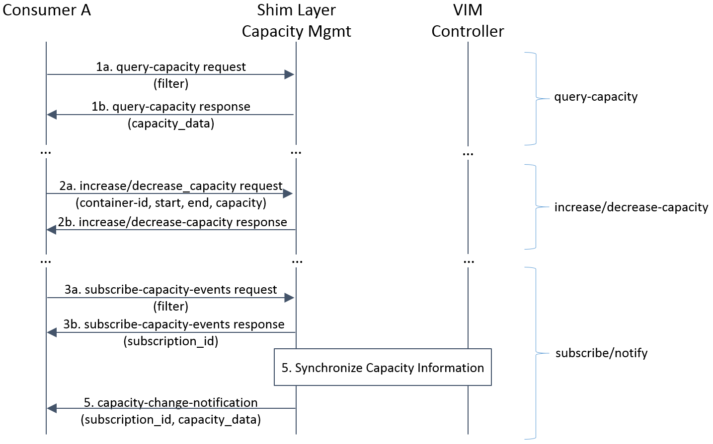
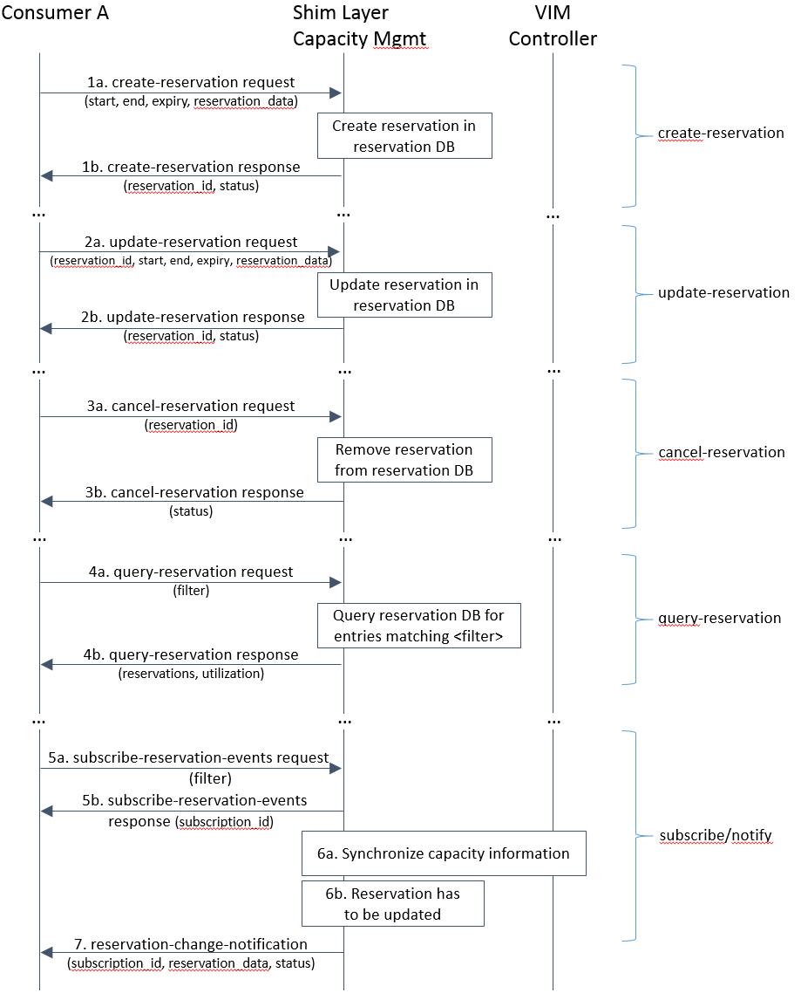

Detailed architecture and message flows
=======================================

Within the Promise project we consider two different architectural options, i.e.
a *shim-layer* based architecture and an architecture targeting at full
OpenStack *integration*.

Shim-layer architecture
-----------------------

The *shim-layer architecture* is using a layer on top of OpenStack to provide
the capacity management, resource reservation, and resource allocation features.

Detailed Message Flows
^^^^^^^^^^^^^^^^^^^^^^

Note, that only selected parameters for the messages are shown. Refer to
:ref:`northbound_API` and Annex :ref:`yang_schema` for a full set of message
parameters.

.. note:: This section has to be updated.

Resource Capacity Management
""""""""""""""""""""""""""""

    Capacity Management Scenario

:numref:`figure5` shows a detailed message flow between the consumers and the
capacity management functional blocks inside the shim-layer. It has the
following steps:

    * Step 1a: The Consumer sends a *query-capacity* request to Promise
      using some filter like time-windows or resource type. The capacity is
      looked up in the shim-layer capacity map.

    * Step 1b: The shim-layer will respond with information about the
      total, available, reserved, and used (allocated) capacities matching the
      filter.

    * Step 2a: The Consumer can send *increase/decrease-capacity* requests
      to update the capacity available to the reservation system. It can be
      100% of available capacity in the given provider/source or only a subset,
      i.e., it can allow for leaving some "buffer" in the actual NFVI to be
      used outside the Promise shim-layer or for a different reservation
      service instance. It can also be used to inform the reservation system
      that from a certain time in the future, additional resources can be
      reserved (e.g. due to a planned upgrade of the capacity), or the
      available capacity will be reduced (e.g. due to a planned downtime of
      some of the resources).

    * Step 2b: The shim-layer will respond with an ACK/NACK message.

    * Step 3a: Consumers can subscribe for capacity-change events using a
      filter.

    * Step 3b: Each successful subscription is responded with a
      subscription_id.

    * Step 4: The Capacity Manager in the shim-layer monitors the capacity
      information for the various types of resources by periodically querying
      the various Controllers (e.g. Nova, Neutron, Cinder) or by creating event
      alarms in the VIM (e.g. with Ceilometer for OpenStack) and updates
      capacity information in its capacity map.

    * Step 5: Capacity changes are notified to the Consumer.

Resource Reservation
""""""""""""""""""""

    Resource Reservation for Future Use Scenario

:numref:`figure6` shows a detailed message flow between the Consumer and the
resource reservation functional blocks inside the shim-layer. It has the
following steps:

    * Step 1a: The Consumer creates a resource reservation request for
      future use by setting a start and end time for the reservation as well as
      more detailed information about the resources to be reserved. The Promise
      shim-layer will check the free capacity in the given time window and in
      case sufficient capacity exists to meet the reservation request, will
      mark those resources "reserved" in its reservation map.

    * Step 1b: If the reservation was successful, a reservation_id and
      status of the reservation will be returned to the Consumer. In case the
      reservation cannot be met, the Reservation Manager may return information
      about the maximum capacity that could be reserved during the requested
      time window and/or a potential time window where the requested (amount
      of) resources would be available.

    * Step 2a: Reservations can be updated using an *update-reservation*,
      providing the reservation_id and the new reservation_data. Promise
      Reservation Manageer will check the feasibility to update the reservation
      as requested.

    * Step 2b: If the reservation was updated successfully, a
      reservation_id and status of the reservation will be returned to the
      Consumer. Otherwise, an appropriate error message will be returned.

    * Step 3a: A *cancel-reservation* request can be used to withdraw an
      existing reservation. Promise will update the reservation map by removing
      the reservation as well as the capacity map by adding the freed capacity.

    * Step 3b: The response message confirms the cancelation.

    * Step 4a: Consumers can also issue *query-reservation* requests to
      receive a list of reservation. An input filter can be used to narrow down
      the query, e.g., only provide reservations in a given time window.
      Promise will query its reservation map to identify reservations matching
      the input filter.

    * Step 4b: The response message contains information about all
      reservations matching the input filter. It also provides information
      about the utilization in the requested time window.

    * Step 5a: Consumers can subscribe for reservation-change events using
      a filter.

    * Step 5b: Each successful subscription is responded with a
      subscription_id.

    * Step 6a: Promise synchronizes the available and used capacity with
      the underlying VIM.

    * Step 6b: In certain cases, e.g., due a failure in the underlying
      hardware, some reservations cannot be kept up anymore and have to be
      updated or canceled. Promise Resource Manager will identify affected
      reservations.

    * Step 7: Subscribed Consumers will be informed about the updated
      reservations. The notification contains the updated reservation_data and
      new status of the reservation. It is then up to the Consumer to take
      appropriate actions in order to ensure high priority reservations are
      favored over lower priority reservations.

Resource Allocation
"""""""""""""""""""

.. note:: This section has to be updated.

Figure **TBD** shows a detailed message flow between the Consumer, the
functional blocks inside the shim-layer, and the VIM. It has the following
steps:

Step 7: When start time of a reservation is about to arrive, the consumer
creates a resource allocation request.

Step 8: The consumer gets an immediate reply with an allocation status message
"allocationStatus".

Step 9: The consumer subscribes to allocation notification events

Step 10: The Resource Allocation Manager allocates the reserved resources. If
not all reserved resources are allocated before expiry, the reserved resources
are released and a notification is sent to the consumer

Step 11: Once the allocation process is completed, the VIM sends a notification
message to the consumer with information on the allocated resources

Integrated architecture
-----------------------

The *integrated architecture* aims at full integration with OpenStack.

Detailed Message Flows
^^^^^^^^^^^^^^^^^^^^^^

.. note:: to be done

Resource Reservation
""""""""""""""""""""

.. note:: to be specified
