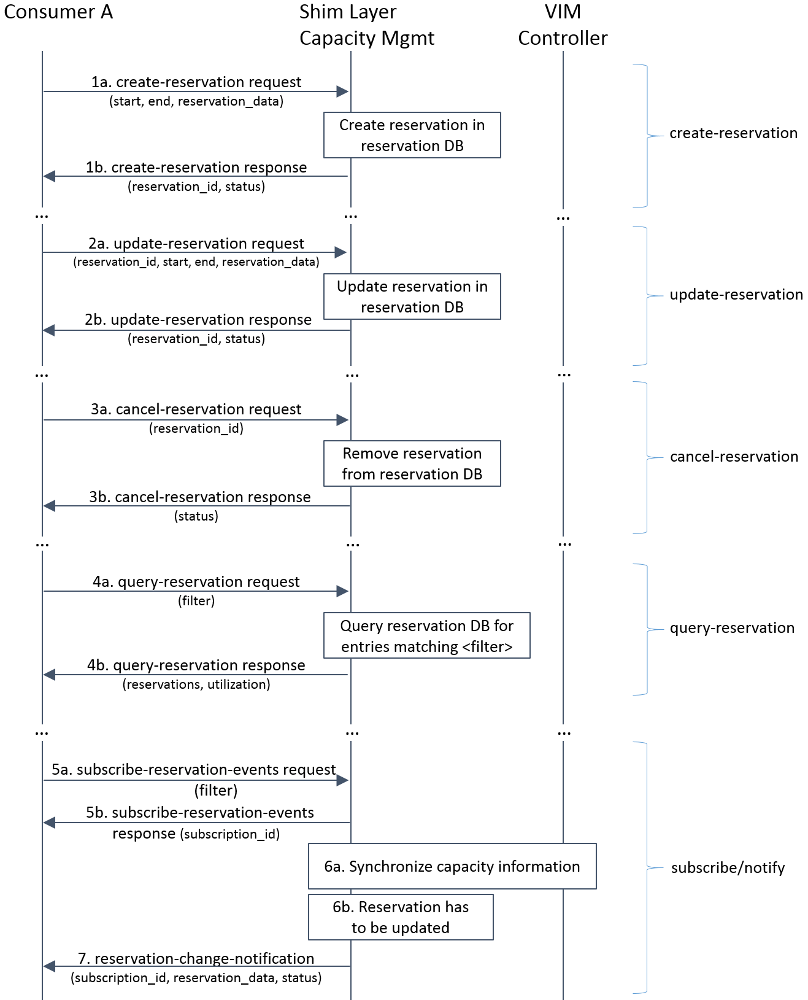

Detailed architecture and message flows
=======================================

Within the Promise project we consider two different architectural options, i.e.
a *shim-layer* based architecture and an architecture targeting at full
OpenStack *integration*.

Shim-layer architecture
-----------------------

The *shim-layer architecture* is using a layer on top of OpenStack to provide
the capacity management, resource reservation, and resource allocation features.

Detailed Message Flows
^^^^^^^^^^^^^^^^^^^^^^

Note, that only selected parameters for the messages are shown. Refer to
:ref:`northbound_API` and Annex :ref:`yang_schema` for a full set of message
parameters.

Resource Capacity Management
""""""""""""""""""""""""""""

.. figure:: images/figure5_new.png
    :name: figure5
    :width: 90%

    Capacity Management Scenario

:numref:`figure5` shows a detailed message flow between the consumers and the
capacity management functional blocks inside the shim-layer. It has the
following steps:

    * Step 1a: The Consumer sends a *query-capacity* request to Promise
      using some filter like time-windows or resource type. The capacity is
      looked up in the shim-layer capacity map.

    * Step 1b: The shim-layer will respond with information about the
      total, available, reserved, and used (allocated) capacities matching the
      filter.

    * Step 2a: The Consumer can send *increase/decrease-capacity* requests
      to update the capacity available to the reservation system. It can be
      100% of available capacity in the given provider/source or only a subset,
      i.e., it can allow for leaving some "buffer" in the actual NFVI to be
      used outside the Promise shim-layer or for a different reservation
      service instance. It can also be used to inform the reservation system
      that from a certain time in the future, additional resources can be
      reserved (e.g. due to a planned upgrade of the capacity), or the
      available capacity will be reduced (e.g. due to a planned downtime of
      some of the resources).

    * Step 2b: The shim-layer will respond with an ACK/NACK message.

    * Step 3a: Consumers can subscribe for capacity-change events using a
      filter.

    * Step 3b: Each successful subscription is responded with a
      subscription_id.

    * Step 4: The shim-layer monitors the capacity information for the
      various types of resources by periodically querying the various
      Controllers (e.g. Nova, Neutron, Cinder) or by creating event alarms in
      the VIM (e.g. with Ceilometer for OpenStack) and updates capacity
      information in its capacity map.

    * Step 5: Capacity changes are notified to the Consumer.

Resource Reservation
""""""""""""""""""""

    Resource Reservation for Future Use Scenario

:numref:`figure6` shows a detailed message flow between the Consumer and the
resource reservation functional blocks inside the shim-layer. It has the
following steps:

    * Step 1a: The Consumer creates a resource reservation request for
      future use by setting a start and end time for the reservation as well as
      more detailed information about the resources to be reserved. The Promise
      shim-layer will check the free capacity in the given time window and in
      case sufficient capacity exists to meet the reservation request, will
      mark those resources "reserved" in its reservation map.

    * Step 1b: If the reservation was successful, a reservation_id and
      status of the reservation will be returned to the Consumer. In case the
      reservation cannot be met, the shim-layer may return information about
      the maximum capacity that could be reserved during the requested time
      window and/or a potential time window where the requested (amount of)
      resources would be available.

    * Step 2a: Reservations can be updated using an *update-reservation*,
      providing the reservation_id and the new reservation_data. Promise
      Reservation Manageer will check the feasibility to update the reservation
      as requested.

    * Step 2b: If the reservation was updated successfully, a
      reservation_id and status of the reservation will be returned to the
      Consumer. Otherwise, an appropriate error message will be returned.

    * Step 3a: A *cancel-reservation* request can be used to withdraw an
      existing reservation. Promise will update the reservation map by removing
      the reservation as well as the capacity map by adding the freed capacity.

    * Step 3b: The response message confirms the cancelation.

    * Step 4a: Consumers can also issue *query-reservation* requests to
      receive a list of reservation. An input filter can be used to narrow down
      the query, e.g., only provide reservations in a given time window.
      Promise will query its reservation map to identify reservations matching
      the input filter.

    * Step 4b: The response message contains information about all
      reservations matching the input filter. It also provides information
      about the utilization in the requested time window.

    * Step 5a: Consumers can subscribe for reservation-change events using
      a filter.

    * Step 5b: Each successful subscription is responded with a
      subscription_id.

    * Step 6a: Promise synchronizes the available and used capacity with
      the underlying VIM.

    * Step 6b: In certain cases, e.g., due a failure in the underlying
      hardware, some reservations cannot be kept up anymore and have to be
      updated or canceled. The shim-layer will identify affected reservations
      among its reservation records.

    * Step 7: Subscribed Consumers will be informed about the updated
      reservations. The notification contains the updated reservation_data and
      new status of the reservation. It is then up to the Consumer to take
      appropriate actions in order to ensure high priority reservations are
      favored over lower priority reservations.

Resource Allocation
"""""""""""""""""""

    Resource Allocation

:numref:`figure7` shows a detailed message flow between the Consumer, the
functional blocks inside the shim-layer, and the VIM. It has the following
steps:

    * Step 1a: The Consumer sends a *create-instance* request providing
      information about the resources to be reserved, i.e., provider_id
      (optional in case of only one provider), name of the instance, the
      requested flavour and image, etc. If the allocation is against an
      existing reservation, the reservation_id has to be provided.

    * Step 1b: If a reservation_id was provided, Promise checks if a
      reservation with that ID exists, the reservation start time has arrived
      (i.e. the reservation is active), and the required capacity for the
      requested flavor is within the available capacity of the reservation. If
      those conditions are met, Promise creates a record for the allocation
      (VMState="INITIALIZED") and update its databases. If no reservation_id
      was provided in the allocation request, Promise checks whether the
      required capacity to meet the request can be provided from the available,
      non-reserved capacity. If yes, Promise creates a record for the
      allocation and update its databases. In any other case, Promise rejects
      the *create-instance* request.

    * Step 2: In the case the *create-instance* request was rejected,
      Promise responds with a "status=rejected" providing the reason of the
      rejection. This will help the Consumer to take appropriate actions, e.g.,
      send an updated *create-instance* request. The allocation work flow will
      terminate at this step and the below steps are not executed.

    * Step 3a: If the *create-instance* request was accepted and a related
      allocation record has been created, the shim-layer issues a
      *createServer* request to the VIM Controller providing all information to
      create the server instance.

    * Step 3b: The VIM Controller sends an immediate reply with an
      instance_id and starts the VIM-internal allocation process.

    * Step 4: The Consumer gets an immediate response message with
      allocation status "in progress" and the assigned instance_id.

    * Step 5a+b: The consumer subscribes to receive notifications about
      allocation events related to the requested instance. Promise responds
      with an acknowledgment including a subscribe_id.

    * Step 6: In parallel to the previous step, Promise shim-layer creates
      an alarm in Aodh to receive notifications about all changes to the
      VMState for instance_id.

    * Step 7a: The VIM Controller notifies all instance related events to
      Ceilometer. After the allocation has been completed or failed, it sends
      an event to Ceilometer. This triggers the OpenStack alarming service Aodh
      to notify the new VMState (e.g. ACTIVE and ERROR) to the shim-layer that
      updates its internal allocation records.

    * Step 7b: Promise sends a notification message to the subscribed
      Consumer with information on the allocated resources including their new
      VMState.

    * Step 8a+b: Allocated instances can be terminated by the Consumer by
      sending a *destroy-instance* request to the shim-layer. Promise responds
      with an acknowledgment and the new status "DELETING" for the instance.

    * Step 9a: Promise sends a *deleteServer* request for the instance_id
      to the VIM Controller.

    * Step 10a: After the instance has been deleted, an event alarm is
      sent to the shim-layer that updates its internal allocation records and
      capacity utilization.

    * Step 10b: The shim-layer also notifies the subscribed Consumer about
      the successfully destroyed instance.

Internal operations
^^^^^^^^^^^^^^^^^^^

.. note:: This section is to be updated

In the following, the internal logic and operations of the shim-layer will be
explained in more detail, e.g. the "check request" (step 1b in
:numref:`figure7` of the allocation work flow).

Integrated architecture
-----------------------

The *integrated architecture* aims at full integration with OpenStack.

Detailed Message Flows
^^^^^^^^^^^^^^^^^^^^^^

.. note:: to be done

Resource Reservation
""""""""""""""""""""

.. note:: to be specified
