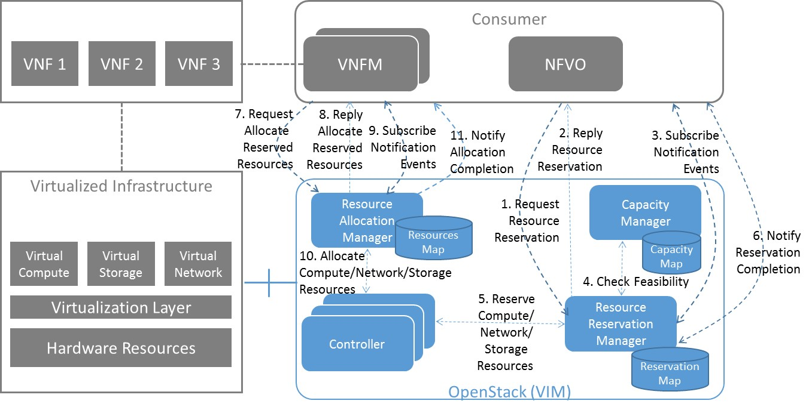

Detailed architecture and message flows
=======================================

Within the Promise project we consider two different architectural options,
i.e. a *shim-layer* based architecture and an architecture targeting at full
OpenStack *integration*.

Shim-layer architecture
-----------------------

The *shim-layer architecture* is using a layer on top of OpenStack to provide
the capacity management, resource reservation, and resource allocation
features.

Detailed Message Flows
^^^^^^^^^^^^^^^^^^^^^^

.. note:: This section has to be updated.

Resource Capacity Management
""""""""""""""""""""""""""""

.. figure:: images/figure5.png
    :name: figure5
    :width: 90%

    Capacity Management Scenario

:numref:`figure5` shows a detailed message flow between the consumers and the
functional blocks inside the VIM and has the following steps:

Step 1: The consumer subscribes to capacity change notifications

Step 2: The Capacity Manager monitors the capacity information for the various
types of resources by querying the various Controllers (e.g. Nova, Neutron,
Cinder), either periodically or on demand and updates capacity information in
the Capacity Map

Step 3: Capacity changes are notified to the consumer

Step 4: The consumer queries the Capacity Manager to retrieve capacity detailed
information

Resource Reservation
""""""""""""""""""""

    Resource Reservation for Future Use Scenario

:numref:`figure6` shows a detailed message flow between the consumers and the
functional blocks inside the VIM and has the following steps:

Step 1: The consumer creates a resource reservation request for future use by
setting a start and end time for the allocation

Step 2: The consumer gets an immediate reply with a reservation status message
"reservationStatus" and an identifier to be used with this reservation instance
"reservationID"

Step 3: The consumer subscribes to reservation notification events

Step 4: The Resource Reservation Manager checks the feasibility of the
reservation request by consulting the Capacity Manager

Step 5: The Resource Reservation Manager reserves the resources and stores the
list of reservations IDs generated by the Controllers (e.g. Nova, Neutron,
Cinder) in the Reservation Map

Step 6: Once the reservation process is completed, the VIM sends a notification
message to the consumer with information on the reserved resources

Step 7: When start time arrives, the consumer creates a resource allocation
request.

Step 8: The consumer gets an immediate reply with an allocation status message
"allocationStatus".

Step 9: The consumer subscribes to allocation notification events

Step 10: The Resource Allocation Manager allocates the reserved resources. If
not all reserved resources are allocated before expiry, the reserved resources
are released and a notification is sent to the consumer

Step 11: Once the allocation process is completed, the VIM sends a notification
message to the consumer with information on the allocated resources

Integrated architecture
-----------------------

The *integrated architecture* aims at full integration with OpenStack.
This means that it is planned to use the already existing OpenStack APIs
extended with the reservation capabilities.

The advantage of this approach is that we don't need to re-model the
complex resource structure we have for the virtual machines and the
corresponding infrastructure.

The atomic item is the virtual machine with the minimum set of resources
it requires to be able to start it up. It is important to state that
resource reservation is handled on VM instance level as opposed to standalone
resources like CPU, memory and so forth. As the placement is an important
aspect in order to be able to use the reserved resources it provides the
constraint to handle resources in groups.

The placement constraint also makes it impossible to use a quota management
system to solve the base use case described earlier in this document.

OpenStack had a project called Blazar, which was created in order to provide
resource reservation functionality in cloud environments. It uses the Shelve
API of Nova, which provides a sub-optimal solution. Due to the fact that this
feature blocks the reserved resources this solution cannot be considered to
be final. Further work is needed to reach a more optimal stage, where the
Nova scheduler is intended to be used to schedule the resources for future
use to make the reservations.

Phases of the work
^^^^^^^^^^^^^^^^^^

The work has stages to reach the final solution. The following main work items
are on the roadmap for this approach:

#. Fix the code base of the Blazar project:

   Due to integration difficulties the Blazar project got suspended. Since the last
   activities in that repository the OpenStack code base and environment changed
   significantly, which means that the project's code base needs to be updted to the
   latest standards and has to be able to interact with the latest version of the
   other OpenStack services.

#. Update the Blazar API

  The REST API needs to be extended to contain the attributes for the reservation
  defined in this document. This activity shall include testing towards the new API.

#. Analyze the Nova scheduler

  The status and the possible interface between the resource reservation system and
  the Nova scheduler needs to be identified. It is crucial to achieve a much more
  optimal solution than what the current version of Blazar can provide. The goal is
  to be able to build a Gantt chart (not equal to the Gantt project in OpenStack)
  with the immediate and future reservations.

#. Define a new design based on the analysis and start the work on it

Detailed Message Flows
^^^^^^^^^^^^^^^^^^^^^^

.. note:: to be done

Resource Reservation
""""""""""""""""""""

.. note:: to be specified
