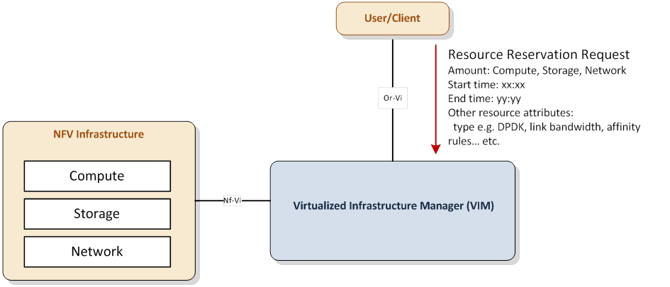

============================================
High level architecture and general features
============================================

Architecture Overview
=====================

   Resource Reservation Architecture

:numref:`figure1` shows the high level architecture for the resource
reservation use cases. Reserved resources are guaranteed for a given
user/client for the period expressed by start and end time. User/client
represents the requestor and the consequent consumer of the reserved
resources and correspond to the NFVO or VNFM in ETSI NFV terminology.

Note: in this document only reservation requests from NFVO are considered.

General Features
================

This section provides a list of features that need to be developed in the
Promise project.

* Resource capacity management

  * Discovery of available resource capacity in resource providers
  * Monitoring of available resource capacity in resource providers
  * Update available resource capacity as a result of new or expired
    reservations, addition/removal of resources. Note: this is a VIM internal
    function, not an operation in the VIM northbound interface.

* Resource reservation

  * Set start time and end time for allocation
  * Increase/decrease reserved resource's capacity
  * Update resource reservations, e.g. add/remove reserved resources
  * Terminate an allocated resource due to the end time of a reservation

* VIM northbound interfaces

  * Receive/Reply resource reservation requests
  * Receive/Reply resource capacity management requests
  * Receive/Reply resource allocation requests for reserved resources when
    start time arrives
  * Subscribe/Notify resource reservation event

    * Notify reservation error or process completion prior to reservation start
    * Notify remaining time until termination of a resource due to the end time
      of a reservation
    * Notify termination of a resource due to the end time of a reservation

  * Receive/Reply queries on available resource capacity
  * Subscribe/Notify changes in available resource capacity

High level northbound interface specification
=============================================

Resource Capacity Management
----------------------------

.. figure:: images/figure2.png
   :name: figure2
   :width: 90%

   Resource capacity management message flow: notification of capacity change

:numref:`figure2` shows a high level flow for a use case of resource capacity
management. In this example, the VIM notifies the NFVO of capacity change after
having received an event regarding a change in capacity (e.g. a fault
notification) from the NFVI. The NFVO can also retrieve detailed capacity
information using the Query Capacity Request interface operation.

.. figure:: images/figure3.png
   :name: figure3
   :width: 90%

   Resource capacity management message flow: query of capacity density

:numref:`figure3` shows a high level flow for another use case of resource
capacity management. In this example, the NFVO queries the VIM about the
actual capacity to instantiate a certain resource according to a certain
template, for example a VM according to a certain flavor. In this case
the VIM responds with the number of VMs that could be instantiated according
to that flavor with the currently available capacity.

Resource Reservation
--------------------

.. figure:: images/figure4.png
   :name: figure4
   :width: 90%

   Resource reservation flow

:numref:`figure4` shows a high level flow for a use case of resource
reservation.
The main steps are:

* The NFVO sends a resource reservation request to the VIM using the Create
  Resource Reservation Request interface operation.
* The NFVO gets a reservation identifier reservation associated with this
  request in the reply message
* Using the reservation identifier reservation, the NFVO can
  query/update/terminate a resource reservation using the corresponding
  interface operations
* The NFVO is notified that the resource reservation is terminated due to the
  end time of the reservation

Information elements
====================

Resource Capacity Management
----------------------------

Notify Capacity Change Event
^^^^^^^^^^^^^^^^^^^^^^^^^^^^

The notification change message shall include the following information
elements:

============================ ========== =====================================
Name                         Type       Description
============================ ========== =====================================
Notification                 Identifier Identifier issued by the VIM for the
                                        capacity change event notification
Zone                         Identifier Identifier of the zone where capacity
                                        has changed
Used/Reserved/Total Capacity List       Used, reserved and total capacity
                                        information regarding the resource
                                        items subscribed for notification for
                                        which capacity change event occurred
============================ ========== =====================================

Query Resource Capacity Request
^^^^^^^^^^^^^^^^^^^^^^^^^^^^^^^

The capacity management query request message shall include the following
information elements:

========== ========== ======================================================
Name       Type       Description
========== ========== ======================================================
Zone       Identifier Identifier of the zone where capacity is requested
Attributes List       Attributes of resource items to be notified regarding
                      capacity change events
Resources  List       Identifiers of existing resource items to be queried
                      regarding capacity info (such as images, flavors,
                      virtual containers, networks, physical machines, etc.)
========== ========== ======================================================

The capacity management query request message may also include the following
information element:

====== ========== ==========================================================
Name   Type       Description
====== ========== ==========================================================
Flavor Identifier Identifier that is passed in the request to obtain
                  information of the number of virtual resources that can be
                  instantiated according to this flavor with the available
                  capacity
====== ========== ==========================================================

Query Resource Capacity Reply
^^^^^^^^^^^^^^^^^^^^^^^^^^^^^

The capacity management query reply message shall include the following
information elements:

============================ ========== =====================================
Name                         Type       Description
============================ ========== =====================================
Zone                         Identifier Identifier of the zone where capacity
                                        is requested
Used/Reserved/Total Capacity List       Used, reserved and total capacity
                                        information regarding each of the
                                        resource items requested to check for
                                        capacity
============================ ========== =====================================

The detailed specification of the northbound interface for Capacity Management
in provided in section 5.1.1.

Resource Reservation
--------------------

Create Resource Reservation Request
^^^^^^^^^^^^^^^^^^^^^^^^^^^^^^^^^^^

The create resource reservation request message shall include the following
information elements:

========== ========== =========================================================
Name       Type       Description
========== ========== =========================================================
Start      Timestamp  Start time for consumption of the reserved resources
End        Timestamp  End time for consumption of the reserved resources
Expiry     Timestamp  If not all reserved resources are allocated between start
                      time and expiry, the VIM shall release the corresponding
                      resources [#expiry]_
Amount     Number     Amount of the resources per resource item type (i.e.
                      compute/network/storage) that need to be reserved
Zone       Identifier The zone  where the resources need(s) to be reserved
Attributes List       Attributes of the resources to be reserved such as DPDK
                      support, hypervisor, network link bandwidth, affinity
                      rules, etc.
Resources  List       Identifiers of existing resource items to be reserved
                      (such as images, flavors, virtual containers, networks,
                      physical machines, etc.)
========== ========== =========================================================

.. [#expiry] Expiry is a period around start time within which, the allocation
             process must take place. If allocation process does not start
             within the expiry period, the reservation becomes invalid and VIM
             should release the resources

Create Resource Reservation Reply
^^^^^^^^^^^^^^^^^^^^^^^^^^^^^^^^^

The create resource reservation reply message shall include the following
information elements:

=========== ========== =======================================================
Name        Type       Description
=========== ========== =======================================================
Reservation Identifier Identification of the reservation instance. It can be
                       used by a consumer to modify the reservation later, and
                       to request the allocation of the reserved resources.
Message     Text       Output message that provides additional information
                       about the create resource reservation request (e.g. may
                       be a simple ACK if the request is being background
                       processed by the VIM)
=========== ========== =======================================================

Notify Reservation Event
^^^^^^^^^^^^^^^^^^^^^^^^

The notification reservation event message shall include the following
information elements:

============ ========== =====================================================
Name         Type       Description
============ ========== =====================================================
Reservation  Identifier Identification of the reservation instance triggering
                        the event
Notification Identifier Identification of the resource event notification
                        issued by the VIM
Message      Text       Message describing the event
============ ========== =====================================================

The detailed specification of the northbound interface for Resource Reservation
is provided in section 5.1.2.
