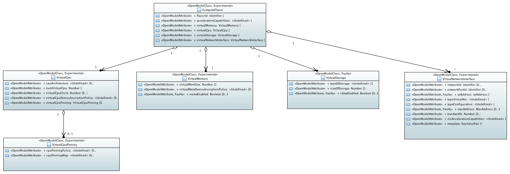

Detailed architecture and message flows
=======================================

Detailed northbound interface specification
-------------------------------------------

.. Note::
   This is Work in Progress.

ETSI NFV IFA Information Models
~~~~~~~~~~~~~~~~~~~~~~~~~~~~~~~

Compute Flavor
^^^^^^^^^^^^^^

A compute flavor includes information about number of virtual CPUs, size of virtual memory,
size of virtual storage, and virtual network interfaces [NFVIFA005]_

Virtualised Compute Resources
~~~~~~~~~~~~~~~~~~~~~~~~~~~~~

Compute Capacity Management
^^^^^^^^^^^^^^^^^^^^^^^^^^^

Subscribe Compute Capacity Change Event
_______________________________________

Subscription from Consumer to VIM to be notified about compute capacity changes

.. http:post:: /capacity/compute/subscribe
   :noindex:

   **Example request**:

   .. sourcecode:: http

       POST /capacity/compute/subscribe HTTP/1.1
       Accept: application/json

       {
          "zoneId": "12345",
          "resourceDescriptor": [
              {
                 "computeResourceTypeId": "vcInstances"
              }
          ],
          "threshold": [
              {
                 "capacity_info": "available",
                 "condition": "lt",
                 "value": 5
              }
          ]
      }

   **Example response**:

   .. sourcecode:: http

       HTTP/1.1 201 CREATED
       Content-Type: application/json

       {
          "created": "2015-09-21T00:00:00Z",
          "capacityChangeSubscriptionId": "abcdef-ghijkl-123456789"
       }

   :statuscode 400: resourceDescriptor is missing

Query Compute Capacity
______________________

Request to find out about available, reserved, total and allocated compute capacity.

.. http:get:: /capacity/compute/query
   :noindex:

   **Example request**:

   .. sourcecode:: http

      GET /capacity/compute/query HTTP/1.1
      Accept: application/json

      {
        "zoneId": "12345",
        "resourceDescriptor":  {
             "computeResourceTypeId": "vcInstances"
        },
        "timePeriod":  {
             "startTime": "2015-09-21T00:00:00Z",
             "stopTime": "2015-09-21T00:05:30Z"
        }
      }

   **Example response**:

   .. sourcecode:: http

       HTTP/1.1 200 OK
       Content-Type: application/json

       {
          "zoneId": "12345",
          "lastUpdate": "2015-09-21T00:03:20Z",
          "capacityInformation": {
             "available": 4,
             "reserved": 17,
             "total": 50,
             "allocated": 29
          }
       }

   :query limit: Default is 10.
   :statuscode 404: resource zone unknown

Notify Compute Capacity Change Event
____________________________________

Notification about compute capacity changes

.. http:post:: /capacity/compute/notification
   :noindex:

   **Example notification**:

   .. sourcecode:: http

      Content-Type: application/json

      {
           "zoneId": "12345",
           "notificationId": "zyxwvu-tsrqpo-987654321",
           "capacityChangeTime": "2015-09-21T00:03:20Z",
           "resourceDescriptor": {
              "computeResourceTypeId": "vcInstances"
           },
           "capacityInformation": {
              "available": 4,
              "reserved": 17,
              "total": 50,
              "allocated": 29
           }
      }

Compute Resource Reservation
^^^^^^^^^^^^^^^^^^^^^^^^^^^^

Create Compute Resource Reservation
___________________________________

Request the reservation of compute resource capacity and/or virtualized containers

.. http:post:: /reservation/compute/create
   :noindex:

   **Example request**:

   .. sourcecode:: http

       POST /reservation/compute/create HTTP/1.1
       Accept: application/json

       {
           "startTime": "2015-09-21T01:00:00Z",
           "computePoolReservation": {
               "numCpuCores": 20,
               "numVcInstances": 5,
               "virtualMemSize": 10
           }
       }

   **Example response**:

   .. sourcecode:: http

       HTTP/1.1 201 CREATED
       Content-Type: application/json

       {
          "reservationData": {
             "startTime": "2015-09-21T01:00:00Z",
             "reservationStatus": "initialized",
             "reservationId": "xxxx-yyyy-zzzz",
             "computePoolReserved": {
                 "numCpuCores": 20,
                 "numVcInstances": 5,
                 "virtualMemSize": 10,
                 "zoneId": "23456"
             }
          }
       }

Query Compute Resource Reservation
__________________________________

Request to find out about reserved compute resources that the consumer has
access to.

.. http:get:: /reservation/compute/query
   :noindex:

   **Example request**:

   .. sourcecode:: http

      GET /reservation/compute/query HTTP/1.1
      Accept: application/json

      {
         "queryReservationFilter": [
             {
                 "reservationId": "xxxx-yyyy-zzzz"
             }
         ]

      }

   **Example response**:

   .. sourcecode:: http

       HTTP/1.1 200 OK
       Content-Type: application/json

       {
          "reservationData":
          {
             "startTime": "2015-09-21T01:00:00Z",
             "reservationStatus": "active",
             "reservationId": "xxxx-yyyy-zzzz",
             "computePoolReserved":
             {
                 "numCpuCores": 20,
                 "numVcInstances": 5,
                 "virtualMemSize": 10,
                 "zoneId": "23456"
             }
          }
       }

   :statuscode 404: reservation id unknown

Update Compute Resource Reservation
___________________________________
Request to update compute resource reservation

.. http:post:: /reservation/compute/update
   :noindex:

   **Example request**:

   .. sourcecode:: http

       POST /reservation/compute/update HTTP/1.1
       Accept: application/json

       {
           "startTime": "2015-09-14T16:00:00Z",
           "reservationId": "xxxx-yyyy-zzzz"
       }

   **Example response**:

   .. sourcecode:: http

       HTTP/1.1 201 CREATED
       Content-Type: application/json

       {
         "reservationData": {
             "startTime": "2015-09-14TT16:00:00Z",
             "reservationStatus": "active",
             "reservationId": "xxxx-yyyy-zzzz",
             "computePoolReserved": {
                 "numCpuCores": 20,
                 "numVcInstances": 5,
                 "virtualMemSize": 10,
                 "zoneId": "23456"
             }
          }
       }

Terminate Compute Resource Reservation
______________________________________
Request to terminate a compute resource reservation

.. http:delete:: /reservation/compute/(reservation_id)

Virtualised Network Resources
~~~~~~~~~~~~~~~~~~~~~~~~~~~~~

Network Capacity Management
^^^^^^^^^^^^^^^^^^^^^^^^^^^

Subscribe Network Capacity Change Event
_______________________________________

Susbcription from Consumer to VIM to be notified about network capacity changes

.. http:post:: /capacity/network/subscribe
   :noindex:

   **Example request**:

   .. sourcecode:: http

        POST /capacity/network/subscribe HTTP/1.1
        Accept: application/json

        {
           "resourceDescriptor": [
                {
                    "networkResourceTypeId": "publicIps"
                }
           ],
           "threshold": [
               {
                  "capacity_info": "available",
                  "condition": "lt",
                  "value": 5
               }
           ]
        }

     **Example response**:

     .. sourcecode:: http

        HTTP/1.1 201 CREATED
        Content-Type: application/json

        {
           "created": "2015-09-28T00:00:00Z",
           "capacityChangeSubscriptionId": "bcdefg-hijklm-234567890"
        }

Query Network Capacity
______________________

Request to find out about available, reserved, total and allocated network capacity.

.. http:get:: /capacity/network/query
   :noindex:

   **Example request**:

   .. sourcecode:: http

      GET /capacity/network/query HTTP/1.1
      Accept: application/json

      {
        "resourceDescriptor":  {
            "networkResourceTypeId": "publicIps"
        },
        "timePeriod":  {
            "startTime": "2015-09-28T00:00:00Z",
            "stopTime": "2015-09-28T00:05:30Z"
        }
     }

   **Example response**:

   .. sourcecode:: http

      HTTP/1.1 200 OK
      Content-Type: application/json

      {
        "lastUpdate": "2015-09-28T00:02:10Z",
        "capacityInformation": {
            "available": 4,
            "reserved": 10,
            "total": 64,
            "allocated": 50
        }
      }

Notify Network Capacity Change Event
____________________________________

Notification about network capacity changes

.. http:post:: /capacity/network/notification
   :noindex:

   **Example notification**:

   .. sourcecode:: http

      Content-Type: application/json

      {
         "notificationId": "yxwvut-srqpon-876543210",
         "capacityChangeTime": "2015-09-28T00:02:10Z",
         "resourceDescriptor": {
            "networkResourceTypeId": "publicIps"
         },
         "capacityInformation": {
           "available": 4,
           "reserved": 10,
           "total": 64,
           "allocated": 50
         }
     }

Network Resource Reservation
^^^^^^^^^^^^^^^^^^^^^^^^^^^^

Create Network Resource Reservation
___________________________________

Request the reservation of network resource capacity and/or virtual networks, network ports

.. http:post:: /reservation/network/create
   :noindex:

   **Example request**:

   .. sourcecode:: http

      POST /reservation/network/create HTTP/1.1
      Accept: application/json

      {
         "startTime": "2015-09-28T01:00:00Z",
         "networkReservation": {
            "numPublicIps": 2
         }
      }

   **Example response**:

   .. sourcecode:: http

       HTTP/1.1 201 CREATED
       Content-Type: application/json

       {
          "reservationData": {
              "startTime": "2015-09-28T01:00:00Z",
              "reservationStatus": "initialized",
              "reservationId": "wwww-xxxx-yyyy",
              "networkReserved": {
                  "publicIps": [
                      "10.2.91.60",
                      "10.2.91.61"
                  ]
              }
          }
       }

Query Network Resource Reservation
__________________________________

Request to find out about reserved network resources that the consumer has access to.

.. http:get:: /reservation/network/query
   :noindex:

   **Example request**:

   .. sourcecode:: http

      GET /reservation/network/query HTTP/1.1
      Accept: application/json

      {
        "queryReservationFilter": [
           {
              "reservationId": "wwww-xxxx-yyyy"
           }
        ]
      }

   **Example response**:

   .. sourcecode:: http

      HTTP/1.1 200 OK
      Content-Type: application/json

      {
         "reservationData": {
            "startTime": "2015-09-28T01:00:00Z",
            "reservationStatus": "active",
            "reservationId": "wwww-xxxx-yyyy",
            "networkReserved": "publicIps": [
              "10.2.91.60",
              "10.2.91.61"
            ]
         }
      }

Update Network Resource Reservation
___________________________________

Request to update network resource reservation

.. http:post:: /reservation/network/update
   :noindex:

   **Example request**:

   .. sourcecode:: http

        POST /reservation/network/update HTTP/1.1
        Accept: application/json

        {
           "startTime": "2015-09-21T16:00:00Z",
           "reservationId": "wwww-xxxx-yyyy"
        }

   **Example response**:

   .. sourcecode:: http

       HTTP/1.1 201 CREATED
       Content-Type: application/json

       {
          "reservationData": {
              "startTime": "2015-09-21T16:00:00Z",
              "reservationStatus": "active",
              "reservationId": "wwww-xxxx-yyyy",
              "networkReserved": {
                  "publicIps": [
                      "10.2.91.60",
                      "10.2.91.61"
                  ]
              }
          }
       }

Terminate Network Resource Reservation
______________________________________
Request to terminate a network resource reservation

.. http:delete:: /reservation/network/(reservation_id)

Virtualised Storage Resources
~~~~~~~~~~~~~~~~~~~~~~~~~~~~~

Storage Capacity Management
^^^^^^^^^^^^^^^^^^^^^^^^^^^

Subscribe Storage Capacity Change Event
_______________________________________

Subscription from Consumer to VIM to be notified about storage capacity changes

.. http:post:: /capacity/storage/subscribe
    :noindex:

    **Example request**:

    .. sourcecode:: http

        POST /capacity/storage/subscribe HTTP/1.1
        Accept: application/json

        {
           "resourceDescriptor": [
              {
                 "storageResourceTypeId": "volumes"
              }
           ],
           "threshold": [
              {
                "capacity_info": "available",
                "condition": "lt",
                "value": 3
              }
           ]
        }

    **Example response**:

    .. sourcecode:: http

       HTTP/1.1 201 CREATED
       Content-Type: application/json

       {
          "created": "2015-09-28T12:00:00Z",
          "capacityChangeSubscriptionId": "cdefgh-ijklmn-345678901"
       }

Query Storage Capacity
______________________

Request to find out about available, reserved, total and allocated storage capacity.

.. http:get:: /capacity/storage/query
    :noindex:

    **Example request**:

    .. sourcecode:: http

        GET /capacity/storage/query HTTP/1.1
        Accept: application/json

        {
           "resourceDescriptor": {
              "storageResourceTypeId": "volumes"
           },
           "timePeriod":  {
             "startTime": "2015-09-28T12:00:00Z",
             "stopTime": "2015-09-28T12:04:45Z"
           }
        }

    **Example response**:

    .. sourcecode:: http

       HTTP/1.1 200 OK
       Content-Type: application/json

       {
           "lastUpdate": "2015-09-28T12:01:35Z",
           "capacityInformation": {
              "available": 2,
              "reserved": 4,
              "total": 10,
              "allocated": 4
           }
       }

Notify Storage Capacity Change Event
____________________________________

Notification about storage capacity changes

.. http:post:: /capacity/storage/notification
   :noindex:

   **Example notification**:

   .. sourcecode:: http

       Content-Type: application/json

       {
          "notificationId": "xwvuts-rqponm-765432109",
          "capacityChangeTime": "2015-09-28T12:01:35Z",
          "resourceDescriptor": {
              "storageResourceTypeId": "volumes"
          },
          "capacityInformation": {
             "available": 2,
             "reserved": 4,
             "total": 10,
             "allocated": 4
          }
       }

Storage Resource Reservation
^^^^^^^^^^^^^^^^^^^^^^^^^^^^

Create Storage Resource Reservation
___________________________________

Request the reservation of storage resource capacity

.. http:post:: /reservation/storage/create
   :noindex:

   **Example request**:

   .. sourcecode:: http

      POST /reservation/storage/create HTTP/1.1
      Accept: application/json

      {
          "startTime": "2015-09-28T13:00:00Z",
          "storagePoolReservation": {
             "storageSize": 10,
             "numSnapshots": 3,
             "numVolumes": 2
          }
      }

   **Example response**:

   .. sourcecode:: http

      HTTP/1.1 201 CREATED
      Content-Type: application/json

      {
          "reservationData": {
              "startTime": "2015-09-28T13:00:00Z",
              "reservationStatus": "initialized",
              "reservationId": "vvvv-wwww-xxxx",
              "storagePoolReserved": {
                 "storageSize": 10,
                 "numSnapshots": 3,
                 "numVolumes": 2
              }
          }
      }

Query Storage Resource Reservation
__________________________________
Request to find out about reserved storage resources that the consumer has access to.

.. http:get:: /reservation/storage/query
   :noindex:

   **Example request**:

   .. sourcecode:: http

      GET /reservation/storage/query HTTP/1.1
      Accept: application/json

      {
         "queryReservationFilter": [
             {
                "reservationId": "vvvv-wwww-xxxx"
             }
         ]
      }

   **Example response**:

   .. sourcecode:: http

      HTTP/1.1 200 OK
      Content-Type: application/json

      {
         "reservationData": {
            "startTime": "2015-09-28T13:00:00Z",
            "reservationStatus": "active",
            "reservationId": "vvvv-wwww-xxxx",
            "storagePoolReserved": {
                 "storageSize": 10,
                 "numSnapshots": 3,
                 "numVolumes": 2
            }
         }
      }

Update Storage Resource Reservation
___________________________________

Request to update storage resource reservation

.. http:post:: /reservation/storage/update
   :noindex:

   **Example request**:

   .. sourcecode:: http

	POST /reservation/storage/update HTTP/1.1
        Accept: application/json

	{
           "startTime": "2015-09-20T23:00:00Z",
           "reservationId": "vvvv-wwww-xxxx"
	}

   **Example response**:

   .. sourcecode:: http

       HTTP/1.1 201 CREATED
       Content-Type: application/json

       {
          "reservationData": {
              "startTime": "2015-09-20T23:00:00Z",
	      "reservationStatus": "active",
              "reservationId": "vvvv-wwww-xxxx",
              "storagePoolReserved": {
                  "storageSize": 10,
                  "numSnapshots": 3,
                  "numVolumes": 2
              }
          }
       }

Terminate Storage Resource Reservation
______________________________________
Request to terminate a storage resource reservation

.. http:delete:: /reservation/storage/(reservation_id)

Detailed Message Flows
----------------------

Resource Capacity Management
^^^^^^^^^^^^^^^^^^^^^^^^^^^^

.. figure:: images/figure5.png
   :name: figure5
   :width: 90%

   Capacity Management Scenario

:numref:`figure5` shows a detailed message flow between the consumers and the
functional blocks inside the VIM and has the following steps:

Step 1: The consumer subscribes to capacity change notifications

Step 2: The Capacity Manager monitors the capacity information for the various
types of resources by querying the various Controllers (e.g. Nova, Neutron,
Cinder), either periodically or on demand and updates capacity information in
the Capacity Map

Step 3: Capacity changes are notified to the consumer

Step 4: The consumer queries the Capacity Manager to retrieve capacity detailed
information

Resource Reservation
^^^^^^^^^^^^^^^^^^^^

.. figure:: images/figure6.png
   :name: figure6
   :width: 90%

   Resource Reservation for Future Use Scenario

:numref:`figure6` shows a detailed message flow between the consumers and
the functional blocks inside the VIM and has the following steps:

Step 1: The consumer creates a resource reservation request for future use by
setting a start and end time for the allocation

Step 2: The consumer gets an immediate reply with a reservation status message
"reservationStatus" and an identifier to be used with this reservation instance
"reservationID"

Step 3: The consumer subscribes to reservation notification events

Step 4: The Resource Reservation Manager checks the feasibility of the
reservation request by consulting the Capacity Manager

Step 5: The Resource Reservation Manager reserves the resources and stores the
list of reservations IDs generated by the Controllers (e.g. Nova, Neutron,
Cinder) in the Reservation Map

Step 6: Once the reservation process is completed, the VIM sends a notification
message to the consumer with information on the reserved resources

Step 7: When start time arrives, the consumer creates a resource allocation
request.

Step 8: The consumer gets an immediate reply with an allocation status message
"allocationStatus".

Step 9: The consumer subscribes to allocation notification events

Step 10: The Resource Allocation Manager allocates the reserved resources. If
not all reserved resources are allocated before expiry, the reserved resources
are released and a notification is sent to the consumer

Step 11: Once the allocation process is completed, the VIM sends a notification
message to the consumer with information on the allocated resources
