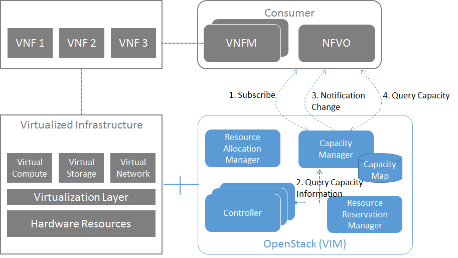
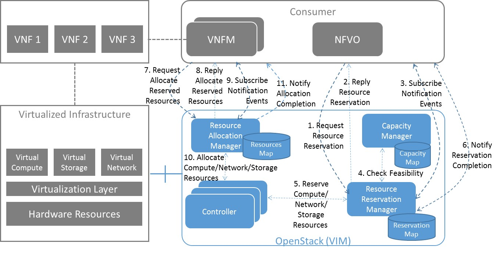

Detailed implementation plan
============================

Detailed northbound interface specification from ETSI NFV IFA
-------------------------------------------------------------

.. Note::
   Once the output of the work from ETSI NFV IFA has been made publicly
   available, the UML diagrams and REST/JSON examples in this section will be
   extended

Resource Capacity Management
^^^^^^^^^^^^^^^^^^^^^^^^^^^^

Subscribe Capacity Change Event
_______________________________

SubscribeRequest (Consumer -> VIM)
""""""""""""""""""""""""""""""""""

.. uml::

   @startuml
   class SubscribeRequest {
      + zone [0..N]: Identifier
      + attributes [0..1]: String
      + resourceItems [0..1]: String
      + thresholds [0..N]: String
      + notificationId [0..1]: Identifier
   }
   @enduml

Subscription from Consumer to VIM to be notified about capacity changes.
**Input Parameters**:

* Zone [0..N]: Identification of the zone(s) to notify regarding capacity
  change events
* Attributes [0..1]: Attributes of resource items to be notified regarding
  capacity change events
* ResourceItems [0..1]: Identifiers of existing resource items to be notified
  regarding capacity change events (such as images, flavors, virtual
  containers, networks, physical machines, etc.)
* Thresholds [0..N]: Lower/Upper limits for triggering change event for
  used/reserved/total capacity change for specified resource items
* NotificationId [0..1]: Identification of existing capacity change event
  notification issued by the VIM. When specified. The previously defined
  conditions for change event notifications wil be re-used and notification
  sent to the additional requestor.

Application/json::

  {
    "zone": ["opnfv-JP8", "opnfv-JP9"],
    "resourceitems": "numvcinstances"
  }

SubscribeReply (VIM -> Consumer)
""""""""""""""""""""""""""""""""""

.. uml::

   @startuml
   class SubscribeReply {
      + notificationId [1]: Identifier
      + created [1]: DateTime
      + message [0..1]: String
   }
   @enduml

**Reply Parameters**:

* notificationId (Identifier): Identification of the capacity change event
  notification issued by the VIM.
* created (DateTime): Timestamp when subscription has been created
* message [0..1] (String): Output message that provides additional information
  about the subscribe request

Application/json::

  {
    "created": "2015-03-23T00:00:01Z",
    "notificationId": "abcdef-ghijkl-123456789"
  }

Query Resource Capacity
_______________________

QueryRequest (NFVO -> VIM)
""""""""""""""""""""""""""

.. uml::
   :width: 90%

   @startuml
   class QueryCapacityRequest {
      + capacityQueryFilter [0..1]: CapacityQueryFilterClass
   }

   class CapacityQueryFilter {
      + zone [0..1]: Identifier
      + resourceItems [0..1]: String
      + flavorID [0..1]: Identifier
   }

   QueryCapacityRequest "1" *- "0..1" CapacityQueryFilter
   @enduml

.. -*

Request to find out about used, reserved and total capacity.
A CapacityQueryFilter can be used to narrow down the capacity details returned
in the response message.

**Input Parameters**:

* capacityQueryFilter (CapacityQueryFilterClass): Optional information to
  narrow down the QueryCapacityRequest, for example to limit the query to given
  resource items, or a given resource zone. The capacityQueryFilter can also
  include a FlavorId or template ID. In this case, the QueryCapacity is a
  request to obtain information of the number of virtual resources that can be
  instantiated according to this flavor with the actual available capacity.

Application/json::

  {
    "capacityqueryfilter": {
      "resourceitems": "numvcinstances,virtualmemorysize",
      "zone": "opnfv-JP7"
    }
  }

QueryReply (VIM -> NFVO)
""""""""""""""""""""""""

.. uml::

   @startuml
   class QueryCapacityReply {
      + capacityInformation [0..N]: CapacityInformationClass
      + zone [0..1]: Identifier
      + lastUpdate [0..1]: DateTime
      + message [0..1]: String
   }
   
   QueryCapacityReply "1" *- "0..N" CapacityInformationClass
   @enduml

.. -*

**Reply Parameters**:

* capacityInformation [0..N] (CapacityInformationClass): Capacity information
  matching the CapacityQueryFilter specified in the QueryCapacityRequest
* Zone [0..1] (Identifier): Identification of the resource zone
* lastUpdate [0..1] (DateTime): Timestamp of the capacity last update
* message [0..1] (String): Output message that provides additional information
  about the query capacity request

Application/json::

  {
    "capacity": {
      "numvcinstances": {
        "used": 5,
        "reserved": 1,
        "total": 10
      },
      "virtualmemorysize": {
        "used": 4,
        "reserved": 6,
        "total": 16
      }
    },
    "zone":"opnfv-JP7",
    "lastUpdate":"2015-03-23T00:00:00Z"
  }

Notify Capacity Change Event (VIM -> Consumer)
______________________________________________

.. uml::

   @startuml
   class CapacityChangeNotification {
      + capacityInformation [0..1]: CapacityInformationClass
      + zone [0..1]: Identifier
      + notificationTime [1]: DateTime
      + notificationId [1]: Identifier
   }

   QueryCapacityReply "1" *- "0..1" CapacityInformationClass
   @enduml

.. -*

Notification about capacity changes

**Notify Parameters**:

* capacityInformation [0..1] (CapacityInformationClass): Capacity information
  matching a given subscription request defined by the Consumer
* zone [0..1] (Identifier): Identification of the resource zone
* notificationTime [1] (DateTime): Timestamp when the capacity change is
  detected
* notificationId [1]: Identification of the capacity change event notification
  issued by the VIM.

Application/json::

  {
    "capacity": {
      "numvcinstances": {
        "used": 16,
        "reserved": 2,
        "total": 20
      }
    },
    "zone": "opnfv-JP8",
    "notificationTime":"2015-03-23T12:00:05Z",
    "notificationId":"abcdef-ghijkl-123456789"
  }

Resource Reservation
^^^^^^^^^^^^^^^^^^^^

CreateResourceReservation
_________________________

CreateResourceReservationRequest (NFVO -> VIM)
""""""""""""""""""""""""""""""""""""""""""""""

.. uml::

   @startuml
   class CreateResourceReservationRequest {
      + start [0..1]: DateTime
      + end [0..1]: DateTime
      + expiry [0..1]: DateTime
      + virtualizationContainerReservation [0..N]: VirtualizationContainerReservationClass
      + computePoolReservation [0..1]: ComputePoolReservationClass
      + storagePoolReservation [0..1]: StoragePoolReservationClass
      + networkReservation [0..1]: NetworkReservationClass
      + zone [0..1]: Identifier
   }
 
   class VirtualizationContainerReservationClass {
      + containerId [1]: Identifier
      + flavor [0..1]: FlavorClass
   }

   CreateResourceReservationRequest "1" *- "0..N" VirtualizationContainerReservationClass
   VirtualizationContainerReservationClass "1" *-- "0..1" FlavorClass
   CreateResourceReservationRequest "1" *-- "0..1" ComputePoolReservationClass
   CreateResourceReservationRequest "1" *-- "0..1" StoragePoolReservationClass
   CreateResourceReservationRequest "1" *-- "0..1" NetworkReservationClass
   @enduml

.. -*

CreateResourceReservationReply (VIM -> NFVO)
""""""""""""""""""""""""""""""""""""""""""""

.. uml::

   @startuml
   class CreateResourceReservationReply {
      + reservationId [1]: Identifier
      + virtualizationContainerReserved [0..N]: VirtualizationContainerReservedClass
      + computePoolReserved [0..1]: ComputePoolReservedClass
      + storagePoolReserved [0..1]: StoragePoolReservedClass
      + networkReserved [0..1]: NetworkReservedClass
      + reservationStatus [1]: String
      + message [0..1]: String
   }

   class VirtualizationContainerReservedClass {
      + containerId [1]: Identifier
      + flavor [0..1]: FlavorClass
   }

   CreateResourceReservationReply "1" *- "0..N" VirtualizationContainerReservedClass
   VirtualizationContainerReservedClass "1" *-- "0..1" FlavorClass
   CreateResourceReservationReply "1" *-- "0..1" ComputePoolReservedClass
   CreateResourceReservationReply "1" *-- "0..1" StoragePoolReservedClass
   CreateResourceReservationReply "1" *-- "0..1" NetworkReservedClass
   @enduml

.. -*

Subscribe Reservation Event
___________________________

SubscribeRequest (Consumer -> VIM)
""""""""""""""""""""""""""""""""""

.. uml::

   @startuml
   class SubscribeRequest {
      + reservationId [1]: Identifier
      + eventType [0..1]: String
   }
   @enduml

SubscribeReply (VIM -> Consumer)
""""""""""""""""""""""""""""""""

.. uml::

   @startuml
   class SubscribeReply {
      + notificationId [1]: Identifier
      + created [1]: DateTime
      + message [0..1]: String
   }
   @enduml

NotifyReservationEvent (VIM -> Consumer)
________________________________________

.. uml::

   @startuml
   class ReservationEventNotification {
      + notificationId [1]: Identifier
      + reservationId [1]: Identifier
      + notificationTime [1]: DateTime
      + message [0..1]: String
   }
   @enduml

QueryResourceReservation
________________________

QueryResourceReservationRequest (Consumer -> VIM)
"""""""""""""""""""""""""""""""""""""""""""""""""

.. uml::

   @startuml
   class QueryResourceReservationRequest {
      + reservationQueryFilter [0..1]: ReservationQueryFilterClass
   }

   QueryResourceReservationRequest "1" *- "0..1" ReservationQueryFilterClass
   @enduml

.. -*

QueryResourceReservationReply (VIM -> Consumer)
"""""""""""""""""""""""""""""""""""""""""""""""

.. uml::

   @startuml
   class CreateResourceReservationReply {
      + reservationId [1]: Identifier
      + virtualizationContainerReserved [0..N]: VirtualizationContainerReservedClass
      + computePoolReserved [0..1]: ComputePoolReservedClass
      + storagePoolReserved [0..1]: StoragePoolReservedClass
      + networkReserved [0..1]: NetworkReservedClass
      + reservationStatus [1]: String
      + message [0..1]: String
   }

   class VirtualizationContainerReservedClass {
      + containerId [1]: Identifier
      + flavor [0..1]: FlavorClass
   }

   CreateResourceReservationReply "1" *- "0..N" VirtualizationContainerReservedClass
   VirtualizationContainerReservedClass "1" *-- "0..1" FlavorClass
   CreateResourceReservationReply "1" *-- "0..1" ComputePoolReservedClass
   CreateResourceReservationReply "1" *-- "0..1" StoragePoolReservedClass
   CreateResourceReservationReply "1" *-- "0..1" NetworkReservedClass
   @enduml

.. -*

UpdateResourceReservation
_________________________

UpdateResourceReservationRequest (NFVO ->VIM)
"""""""""""""""""""""""""""""""""""""""""""""

.. uml::

   @startuml
   class UpdateResourceReservationRequest {
      + reservationId [1]: Identifier
      + start [0..1]: DateTime
      + end [0..1]: DateTime
      + expiry [0..1]: DateTime
      + virtualizationContainerReservation [0..N]: VirtualizationContainerReservationClass
      + computePoolReservation [0..1]: ComputePoolReservationClass
      + storagePoolReservation [0..1]: StoragePoolReservationClass
      + networkReservation [0..1]: NetworkReservationClass
      + zone [0..1]: Identifier
   }

   class VirtualizationContainerReservationClass {
      + containerId [1]: Identifier
      + flavor [0..1]: FlavorClass
   }

   CreateResourceReservationRequest "1" *- "0..N" VirtualizationContainerReservationClass
   VirtualizationContainerReservationClass "1" *-- "0..1" FlavorClass
   CreateResourceReservationRequest "1" *-- "0..1" ComputePoolReservationClass
   CreateResourceReservationRequest "1" *-- "0..1" StoragePoolReservationClass
   CreateResourceReservationRequest "1" *-- "0..1" NetworkReservationClass
   @enduml

.. -*

UpdateResourceReservationReply (VIM -> NFVO)
""""""""""""""""""""""""""""""""""""""""""""

.. uml::

   @startuml
   class UpdateResourceReservationReply {
      + reservationId [1]: Identifier
      + virtualizationContainerReserved [0..N]: VirtualizationContainerReservedClass
      + computePoolReserved [0..1]: ComputePoolReservedClass
      + storagePoolReserved [0..1]: StoragePoolReservedClass
      + networkReserved [0..1]: NetworkReservedClass
      + reservationStatus [1]: String
      + message [0..1]: String
   }

   class VirtualizationContainerReservedClass {
      + containerId [1]: Identifier
      + flavor [0..1]: FlavorClass
   }

   CreateResourceReservationReply "1" *- "0..N" VirtualizationContainerReservedClass
   VirtualizationContainerReservedClass "1" *-- "0..1" FlavorClass
   CreateResourceReservationReply "1" *-- "0..1" ComputePoolReservedClass
   CreateResourceReservationReply "1" *-- "0..1" StoragePoolReservedClass
   CreateResourceReservationReply "1" *-- "0..1" NetworkReservedClass
   @enduml

.. -*

ReleaseResourceReservation
__________________________

ReleaseResourceReservationRequest (NFVO -> VIM)
"""""""""""""""""""""""""""""""""""""""""""""""

.. uml::

   @startuml
   class ReleaseResourceReservationRequest {
   + reservationId [1]: Identifier
   }
   @enduml

ReleaseResourceReservationReply (VIM -> NFVO)
"""""""""""""""""""""""""""""""""""""""""""""

.. uml::

   @startuml
   class ReleaseResourceReservationReply {
      + reservationId [1]: Identifier
      + message [0..1]: String
   }
   @enduml

Detailed Message Flows
----------------------

Resource Capacity Management
^^^^^^^^^^^^^^^^^^^^^^^^^^^^

   Capacity Management Scenario

Figure 5 shows a detailed message flow between the consumers and the
functionalblocks inside the VIM and has the following steps:

Step 1: The consumer subscribes to capacity change notifications

Step 2: The Capacity Manager monitors the capacity information for the various
types of resources by querying the various Controllers (e.g. Nova, Neutron,
Cinder), either periodically or on demand and updates capacity information in
the Capacity Map

Step 3: Capacity changes are notified to the consumer

Step 4: The consumer queries the Capacity Manager to retrieve capacity detailed
information

Resource Reservation
^^^^^^^^^^^^^^^^^^^^

   Resource Reservation for Future Use Scenario

Figure 6 shows a detailed message flow between the consumers and the functional
blocks inside the VIM and has the following steps:

Step 1: The consumer creates a resource reservation request for future use by
setting a start and end time for the allocation

Step 2: The consumer gets an immediate reply with a reservation status message
"reservationStatus" and an identifier to be used with this reservation instance
"reservationID"

Step 3: The consumer subscribes to reservation notification events

Step 4: The Resource Reservation Manager checks the feasibility of the
reservation request by consulting the Capacity Manager

Step 5: The Resource Reservation Manager reserves the resources and stores the
list of reservations IDs generated by the Controllers (e.g. Nova, Neutron,
Cinder) in the Reservation Map

Step 6: Once the reservation process is completed, the VIM sends a notification
message to the consumer with information on the reserved resources

Step 7: When start time arrives, the consumer creates a resource allocation
request.

Step 8: The consumer gets an immediate reply with an allocation status message
"allocationStatus".

Step 9: The consumer subscribes to allocation notification events

Step 10: The Resource Allocation Manager allocates the reserved resources. If
not all reserved resources are allocated before expiry, the reserved resources
are released and a notification is sent to the consumer

Step 11: Once the allocation process is completed, the VIM sends a notification
message to the consumer with information on the allocated resources

Promise YANG Schemas based on StormForge
----------------------------------------

Promise Schema
^^^^^^^^^^^^^^

.. code::

  module opnfv-promise {
    namespace "urn:opnfv:vim:promise";
    prefix prom;

    import opnfv-promise-models { prefix opm; }
    import complex-types { prefix ct; }

    description
      "OPNFV Promise Resource Reservation/Allocation controller module";

    revision 2015-04-16 {
      description
        "Initial revision.";
    }

    // MAIN CONTAINER

    container promise {
      ct:instance-list reservations {
        description "Aggregate collection of all registered ResourceReservation instances";
        ct:instance-type opm:ResourceReservation;
      }
    }

    rpc list-reservations;
    rpc create-reservation;
    rpc cancel-reservation;

    notification reservation-event;
    notification capacity-event;
    notification allocation-event;
  }

OPNFV Promise YANG Schema
^^^^^^^^^^^^^^^^^^^^^^^^^

.. code::

  module opnfv-promise-models {
    prefix opm;

    import storm-common-models { prefix scm; }
    import complex-types { prefix ct; }

    feature resource-reservation;

    ct:complex-type ResourceReservation {
      ct:extends scm:ResourceElement;

      description
        "Contains the capacities of various resource services being reserved
         along with any resource elements needed to be available at
         the time of allocation(s).";

      reference "OPNFV-PROMISE, Section 3.4.1";

      leaf start { type ct:date-and-time; }
      leaf end   { type ct:date-and-time; }
      leaf expiry {
        description "Duration in seconds from start when unallocated reserved resources will be released back into the pool";
        type number; units "seconds";
      }
      leaf zone { type instance-identifier { ct:instance-type scm:AvailabilityZone; } }
      container capacity {
        uses scm:compute-capacity;
        uses scm:networking-capcity;
        uses scm:storage-capacity;
      }
      leaf-list resources {
        description
          "Reference to a collection of existing resource elements required by
           this reservation. It can contain any instance derived from
           ResourceElement, such as ServerInstances or even other
           ResourceReservations. If the ResourceReservation request is
           accepted, the ResourceElement(s) listed here will be placed
           into 'protected' mode as to prevent accidental delete.";
        type instance-identifier {
          ct:instance-type scm:ResourceElement;
        }
        // following 'must' statement applies to each element
        must "boolean(/provider/elements/*[@id=id])" {
          error-message "One or more of the ResourceElement(s) does not exist in the provider to be reserved";
        }
      }

      leaf provider {
        if-feature multi-provider;
        config false;

        description
          "Reference to a specified existing provider from which this reservation
           will be drawn if used in the context of multi-provider
           environment.";
        type instance-identifier {
          ct:instance-type scm:ResourceProvider;
          require-instance true;
        }
      }

      container remaining {
        config false;
        description
          "Provides visibility into total remaining capacity for this
           reservation based on allocations that took effect utilizing
           this reservation ID as a reference.";

        uses scm:compute-capacity;
        uses scm:networking-capcity;
        uses scm:storage-capacity;
      }

      leaf-list allocations {
        config false;
        description
          "Reference to a collection of consumed allocations referencing
           this reservation.";
        type instance-identifier {
          ct:instance-type ResourceAllocation;
        }
      }

    }

    ct:complex-type ResourceAllocation {
      ct:extends scm:ResourceElement;

      description
         "Contains a list of resources to be allocated with optional reference
         to an existing reservation.

         If reservation is specified but this request is received prior
         to reservation start timestamp, then it will be rejected unless
         'allocate-on-start' is set to true.  'allocate-on-start' allows
         the allocation to be auto-initiated and scheduled to run in the
         future.

         The 'priority' state indicates the classification for dealing
         with resource starvation scenarios. Lower priority allocations
         will be forcefully terminated to allow for higher priority
         allocations to be fulfilled.

         Allocations without reference to an existing reservation will
         receive the lowest priority.";

      reference "OPNFV-PROMISE, Section 3.4.3";

      leaf reservation {
        description "Reference to an existing reservation identifier";

        type instance-identifier {
          ct:instance-type ResourceReservation;
          require-instance true;
        }
      }

      leaf allocate-on-start {
        description
         "If 'allocate-on-start' is set to true, the 'planned' allocations will
         take effect automatically at the reservation 'start' date/time.";
        type boolean; default false;
      }

      ct:instance-list resources {
        description "Contains list of new ResourceElements that will be allocated";
        ct:instance-type scm:ResourceElement;
      }

      leaf priority {
        description
          "Reflects current priority level of the allocation according to classification rules";
        type number;
        config false;
      }
    }
  }

.. -*
